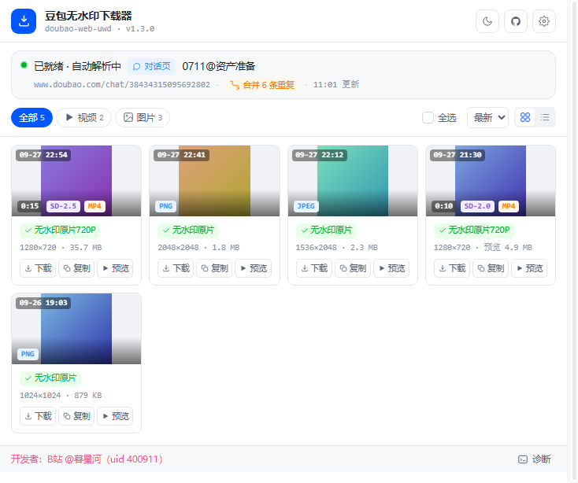
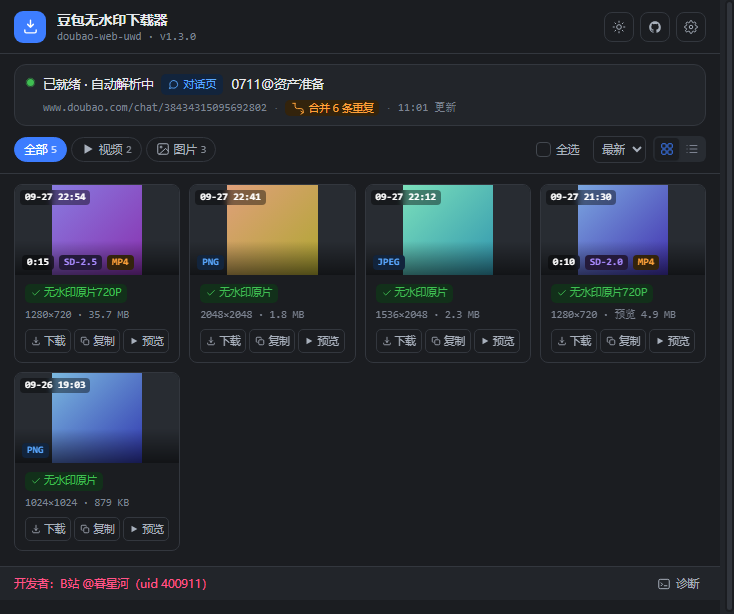

# 🎬 豆包无水印下载器 (doubao-web-uwd)

为豆包（doubao.com）网页端提供**无水印视频 / 图片下载**：自动解析你正在看的对话页与分享链接页，把无水印原片收进弹窗资源库，一键下载或复制直链。

> **页面侧彻底零干预** —— 不注入任何元素、不改任何样式、不拦截任何点击；豆包隐藏的原生下载入口照旧归你自己用，插件的能力全部在弹窗里。





> ⚠️ **本插件为免费开源分享，仅供个人学习研究**，请勿用于商业用途或二次分发无授权内容。
>
> 开发者: [B站 @暮星河](https://space.bilibili.com/400911) | UID: 400911
>
> 本项目基于 [yht-cdd/doubao-seedance-15s](https://github.com/yht-cdd/doubao-seedance-15s) 重构，原作者: [B站 Tps-pwd](https://space.bilibili.com/3546746508544573) | UID: 3546746508544573、[B站 嗯哼de呀](https://space.bilibili.com/491672078) | UID: 491672078

---

## ✨ 功能特性

- ✅ **无水印视频** — 只读解析对话页的 SSE / chain 报文拿到 `vid`，再走三步 API 换取**真正的原片**
- ✅ **无水印图片** — 取 `image_ori_raw` 原片，分辨率从子对象读取（顶层没有该字段）
- ✅ **老对话里「修改生成」的图片也能收录** — 几个月前的老会话，二次编辑产生的图挂在一个旧容器里（`image_list`），站点**没有给无水印档**，只给了两张**水印位置不同、底图完全相同**的图（一张水印在左上、一张在右下）。插件在**下载时**用另一张的同位置像素把那块水印补掉，得到无水印图。  
  ℹ️ 卡片的标签会如实写作「**无水印（补角重建）**」，以区别于站点直接给出的「无水印原片」。  
  ℹ️ 这类条目的「**复制**」按钮不可用：无水印只存在于合成结果里，**没有一个可以直接复制的无水印直链**。  
  ℹ️ 下载前会先校验两张图确实是同一张底图；**不是就绝不补角**，改为保存带水印的那张，并把标签改成「**仅带水印档**」（宁缺勿假）。
- ✅ **分享链接页也能下无水印视频** — `/thread/`（对话分享）与**移动端单条视频分享页**（`/video-sharing?source_type=mobile`，手机「分享 → 复制链接」得到的那种）都自动识别并解析，无需任何手动操作  
  ℹ️ 分享页的视频卡片有**两档无水印**可选：**「下载」= 轻量档**（体积与站点带水印档相当）、**「原画」= 原画质档**（体积随片源，可能几～几十 MB）。这两档走的是站点提供给该分享页的播放源，**文件名里带水印、画面里没有**。  
  ℹ️ 直链**带时效**：插件在你**点下载的那一刻**才去解析，只用于这一次下载，**不入库**、也不提供给「复制」。  
- ✅ **自动分辨页面类型** — 对话页 / 分享链接页 / 豆包页待刷新 / 非豆包页，状态直接显示在弹窗顶部
- ✅ **弹窗即资源库** — 点插件图标就打开资源库（单窗口 720×600，没有二级页面），网格 / 列表两种视图，**滚轮一格翻一屏**（列表 5 条 / 网格两排 4 列），落到整屏边界不错位
- ✅ **批量下载与复制直链** — 筛选视频 / 图片、按**作品真实生成时间**（最新 / 最早）或体积排序、勾选后批量下载或复制直链  
  ℹ️ 批量「复制」会把选中条目的地址**一行一条**放进剪贴板；**没有可直接复制的无水印直链**的条目（补角重建的图、原片还没到手的分享页视频）会被**自动跳过**并在提示里写明跳过了几条 —— 绝不把带水印的地址当成原片复制出去
- ✅ **卡片标注真实生成时间** — 时间取自豆包**消息自带的创作时间**，图片、视频与已过期的旧作品都有，网格视图显示在缩略图左上角
- ✅ **卡片标注文件大小** — 视频取自创作树的记录（与落盘原片字节数一致）；其余条目由插件**实测该可下载文件的真实字节数**，与你在资源库里点「下载」拿到的文件一致。  
  ℹ️ 体积**入库即测**：原片字节数还没到位时，卡片会先把**当前可下载文件**的大小标成「**预览 3.1 MB**」（如 `预览 384×216 · 3.1 MB`），原片就绪后自动换成原片体积并去掉「预览」二字（通常 1 秒内）。  
  ℹ️ **「预览」二字跟着数字走**：即使原片很快解析出来、而体积仍是候选流的，也一定会带着「预览」，不会拿候选流的大小冒充原片；偶尔晚到的预览实测也**不会把已到手的原片大小打回去**（保留真值，并在约 1.5 秒内主动补测一次）；单次测量失败会自动重试一次，仍失败则暂时不显示（宁缺勿假）
- ✅ **视频卡片显示真实宽高与清晰度标签** — 宽高是原片**真实帧尺寸**（不再显示预览规格），并由真实尺寸派生 `720P` 等档位标签；非标准档位只显示真实宽高、不编档位（宁缺勿假）。  
  ℹ️ 单条视频分享页（`/video-sharing`）拿到的本来就是站点提供给该页面的**播放文件**，其宽高会如实标注成「**预览 720×1280**」
- ✅ **视频卡片标注生成模型** — 简称 `SD-2.5` / `SD-2.0` / `2.0-Fast` / `2.0-Mini`（网格视图在缩略图左下角、列表视图在卡片行内；取值读自豆包网页的「本次使用<模型名>生成」信息文案，**读不到就不显示**）
- ✅ **下载文件名自带会话信息** — 格式为 `doubao_作品真实生成时间 对话页标题.扩展名`（如 `doubao_2026-9-27 22-54-37 0925_古装战争史诗视频生成.mp4`）；拿不到生成时间时用下载时刻、拿不到标题时用会话 ID，同名冲突自动加 `-02` 起的序号
- ✅ **深浅色主题** — 跟随系统，也可一键手动切换
- ✅ **内置诊断页** — 站点改版导致解析失效时，把「hook / 接口 / 字段 / 落库」四层事实按时间排列，一键导出 JSON 取证

## 🛠️ 安装方法

### 方式一：直接下载打包好的扩展（推荐，无需构建）

1. 打开本仓库的 [Releases](../../releases) 页面，下载最新版的 `doubao-web-uwd-<版本>.zip`
2. 解压到本地任意目录
3. 打开浏览器，地址栏输入 `chrome://extensions/`（Edge 为 `edge://extensions/`）
4. 开启右上角 **「开发者模式」**
5. 点击 **「加载解压缩的扩展」**
6. 选择**解压出来的目录**（里面应当直接看到 `manifest.json`）
7. 完成！访问 [doubao.com](https://www.doubao.com) 即可使用

### 方式二：从源码构建

> ⚠️ 下载源码后需要自己构建一次。

```bash
npm install
npm run build     # 产出 dist/ —— 它就是「加载解压缩的扩展」要选的目录
```

然后重复上面第 3~7 步，第 6 步选择 **`dist/`** 目录。

> 也可用 `npm run zip` 在本地打出 `release/doubao-web-uwd-<版本>.zip`。
>
> **本机环境备注**：Windows + 托管 Node 环境下，esbuild 的 postinstall 脚本会 `spawnSync node.exe` 做二进制校验并稳定报 `EBUSY`，因此仓库内 `.npmrc` 固定了 `ignore-scripts=true`。二进制由可选依赖 `@esbuild/win32-x64` 提供，跳过脚本**不影响任何功能**；如需恢复，删掉 `.npmrc` 即可。

**最低版本要求**：Chrome / Edge **100+**（MV3 基线）。

## 🚀 使用说明

1. 安装插件后，访问 [豆包](https://www.doubao.com) 的对话页或分享链接页
2. **首次安装（或插件更新）后，请在豆包页按一次 F5** —— 让内容脚本注入并挂上解析 hook
3. 之后正常生成 / 浏览视频与图片即可，插件在后台**只读**解析，页面上不会多出任何东西
4. 点击浏览器工具栏的插件图标 → 弹窗打开就是**资源库**，解析到的无水印原片都在这里
5. 在资源库里点 **「下载」** 保存无水印原片，或点 **「复制」** 拿到直链；勾选后可批量操作
6. 点 **「预览」** 会在豆包页面上定位该素材并唤起**豆包自己的预览**（插件不另做播放器）
7. 刚生成的视频**可能先在卡片上显示「解析中」** —— 站点创作树对刚生成的作品有提交延迟（实测可达两分钟以上）。插件一旦发现「树里暂时查不到」会**每 10 秒自动重扫一次、最多 30 轮（共约 5 分钟）**，作品一登记进树就**自动**给出原片，不需要你操作；而且**只要这部作品还是「刚生成」的（生成时间距现在不足 30 分钟），插件就不会给它下「原片已超期」的结论**，会一直等它入库。只有**已经过了入库窗口、翻遍创作树仍查不到**的作品才会显示「**原片已超期**」（老作品的原片已被站点清除，这类结论约 20 秒即给出）。
8. 若解析请求短时间内触发**站点限流**，相关条目会自动进入几分钟冷却并在之后自行恢复 —— 无需重装插件，也无需任何操作

### 弹窗（资源库）里能看到什么

| 位置       | 内容                                                                                                                                                                                            |
| -------- | --------------------------------------------------------------------------------------------------------------------------------------------------------------------------------------------- |
| 顶部会话卡    | 页面状态（已就绪 / 页面需刷新 / 未检测到豆包页）、页面类型徽标、当前会话名、地址、合并重复条数、更新时间                                                                                                                                       |
| 筛选 chips | 全部 / 视频 / 图片，**数字是唯一的计数**                                                                                                                                                                     |
| 工具条右侧    | 全选（三态勾选框）、排序、网格 / 列表切换                                                                                                                                                                        |
| 卡片       | 缩略图（左上角标注**作品真实生成时间**；左下角一排药丸：时长、**生成模型**（视频，紫色，如 `SD-2.5`）、格式（视频橙黄 / 图片蓝）；列表视图下模型药丸移到**卡片行内、动作按钮左侧**）、状态标签（无水印原片 / 仅缩略图 / 解析中 / 获取失败 / 原片已超期 / **原片不可得** / **无水印（分享页）** / **无水印（补角重建）** / **仅带水印档**）、规格信息（分辨率、**文件大小**、时长）、动作按钮（**下载 / 复制 / 预览**；**分享页视频卡**是 **下载 / 原画 / 预览** —— 分享直链带时效、下载时现解现用，没有可复制的固定直链，所以不提供「复制」；**补角重建的图**保留「复制」但**置灰**，理由同上） |
| 底部状态条    | 开发者信息（下载中切换为进度条）+ 「诊断」入口                                                                                                                                                                      |

> 两个状态标签的区别：**「原片已超期」** 出现在对话页 —— 作品超出了站点保存期（约三个月），  
> 原片已被站点清除；**「原片不可得」** 出现在分享链接页 —— 用非作品所属账号打开时取不到原片  
> （悬停标签可看到说明）。两者都只是**结论如实**，不是下载失败；卡片上的文件大小依然是那个  
> **能下载到的文件**的真实字节数（未拿到原片时会带「预览」前缀，见上面的「卡片标注文件大小」）。

### 三点需要知道的行为

- **资源库按「标签页」隔离，只显示该标签页的当前对话** —— 每个打开的豆包标签页各有一份资源库，互不干扰；在同一标签页里切到别的对话，库就换成那个对话的资源（切回来会重新解析恢复）
- **什么时候会清空**：关掉这个标签页、或它离开对话（回到豆包首页 / 换到别的网站）时，清掉它的那份资源库；浏览器重启后自动重来一遍
- **重置 / 重新解析的唯一入口是 F5** —— 历史资源依赖豆包自己的报文，不刷新页面就无法重放，所以插件没有做「刷新」按钮
- **分享链接页的「原片」只对作品所属账号开放** —— 站点把「我的创作」按账号隔离，原片接口只认自己的作品；  
  其它账号打开同一分享链接取不到创作树里的原片，卡片会如实标注「原片不可得」。**但这不影响下载无水印视频**：  
  分享页走的是站点提供给该页面的两档播放源（「下载」= 轻量档 /「原画」= 原画质档），与账号无关；
  两者都没有时才会回退到带水印的那一档并标注「仅带水印档」

---

📄 许可证：[GNU General Public License v3.0](LICENSE) —— 本项目衍生自 GPL-3.0 的上游项目，沿用同一协议并保留原作者署名。
